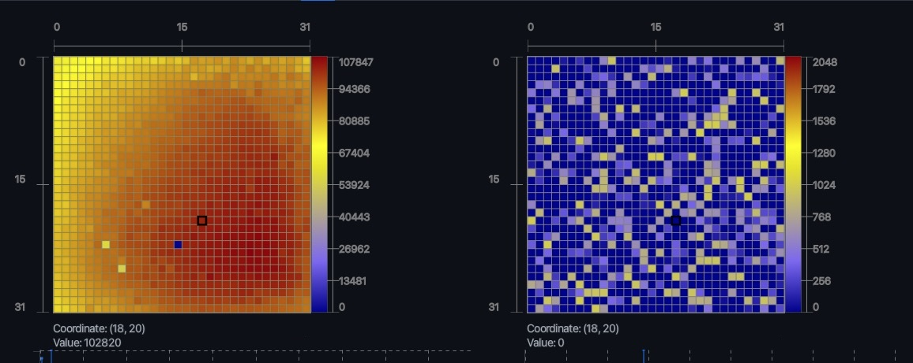

# JFXGrid (In-dev)
## A Fast and Customizable Heatmap Charting Library For JavaFX 💥🚀
JFXGrid is a heatmap imaging library with focus on performance optimized real-time data visualization of Matrices at over 
60 Hz update rates. This library was made as a solution to the [ChartFx](https://github.com/fair-acc/chart-fx) default heatmap implementation which I found
unsuitable for displaying data at video-playback speeds (> 60 FPS). 

<figure>
  
</figure>


>**READ:** <br>
>This plugin is very much in the alpha stages of development, while I've been building up the framework of this library,
many features have not been implemented yet
or are just very premature.
---

### Why?
While developing an application for processing and visualizing LiDAR sensor information, I came into an issue where the current JavaFX Charting libraries available simply didn't have the performance target and other major requirements that I needed. My major points of issue with the available libraries (likely skill issues on my end) came to this:
- Libraries like [ChartFX](https://github.com/fair-acc/chart-fx) are beautiful with many features. However, its heatmap implementation didn't offer what I needed for my use case.
- Issues rendering with speeds > 30fps (it is designed for 25fps so totally within spec).
- Issues visually, such as refusing to display pixels as squares (this was so frustrating I decided to make this).
- After utilizing [OjAlgo](https://www.ojalgo.org), one of the fastest linear algebra/matrix operations library available on java, its speed and memory optimizations with matrices made it incredibly appealing, so I implemented it into this library with success.
  - A caveat to this: 2D Double arrays only have partial support in this, will be gaining more in the future.

>#### Note:
>- [ChartFX](https://github.com/fair-acc/chart-fx/) is an amazing library with lots of functionality and performance, and I would recommend it over this in most other circumstances.
>- There are some similarities with this library and ChartFX. I took inspiration for general structures and design patterns like separate data classes, data factories, and renderers. However, nearly all the code within this library is self-written.
>- This is currently in development while I port the code over from the application I originally made.
>- Going through this code, you're going to find areas where I haven't commented, likely some bugs, and some messy areas. I'm continuously growing this, so if you have any suggestions or have any questions, feel free to contact me or add a pull request!

---

### Installing: 
#### Gradle (won't work yet, still trying to figure out how to publish a maven central package):
In your build.gradle, add this:
```
dependencies {
  implementation 'io.github.aram-ap:jfxgrid:0.0.1'
}
```
--- 

### How does it work?
- **Primary:**
  - `JFXGrid` is the default Node which contains X/Y axis, data label, mouse pointer tools, and the heatmap image itself.
  - `Plugin` objects are plug-in utilities that enable other functionality such as exporting data, zooming in and out, getting mouse cursor location and associated values, averaging multiple frames together, and playing the frames in video playback.
  - `Renderer` handles drawing onto displayed elements. It is split up two primary renderers: AxisRenderer and GridRenderer.
  - `Style` is where we bring in the specific color gradients used in visualizations.
  - `JFXDatasetFactory` creates the dataset and imports data into the dataset.
  - `JFXDataset` is the encapsulating dataset which holds a DataChunk, and all the resources available to play the captured data in real time.
  - `JFXDataDeque` is the child class of the JFXDataSet. Its purpose is to reduce memory utilization, allow for dynamic chunk loading/reloading Chunking to/from the local filesystem, and all other features of the default JFXDataSet class.
- **Other Javafx Nodes:**
  - `Axis` the node containing the canvas used for displaying axis lines.
  - `JFXColorBar` the node containing both an axis and linear gradient for showcasing values.
- **Background (typically not touched by the user):** 
  - `DataChunk` is the custom data group which contains a collection of data frames, and a pointer for going through the chunk in a timeline.
  - `ImageGenerator` is a utility class that takes a dataset and colorizer and turns it into a bitmap image.
  - `JFXClock` is utilized in plugins allowing for timed updates. It includes functionalities such as obtaining delta time in ms and ns and capping frames per second.
  - `TickListener` is an interface utilized by the JFXHeatmap and plugins for timing purposes. It keeps separate timer thread which calls at each frame cycle. It also contains a fixed update call that maintains constant timing which is especially helpful for data playback at a specific framerate.
  - `JFXProcessManager` is the background process manager which manages keeping processes synchronized, prioritization of tasks, and starting background processes.
- **Plugins:**
  - `GridPlayer` is the primary plugin that allows for playing frames in video-format. It handles frame iteration, timing, pausing, and playing.
  - `Zoomer` allows instantaneous resizing of the grid.
  - `Exporter` handles file output and screenshots
  - `Marquee` is a tool used for zooming into specific points and disabling specific elements
  - `MouseInput` is a plugin built into many plugins that allow mouse inputs to cause actions
  - `Averaging` is an image processing tool which takes multiple frames and averages them into a single frame. Best used when you're dealing with sparse matrices.

### Code Examples (still IN-DEV, so these are mostly non-functional (for now)):
The basics (32 x 32 grid): 
```
  Pane root = new Pane();
  JFXGrid grid = new JFXGrid(32, 32); //The central JFXGrid javafx node
  root.getChildren().add(grid);
```
Adding data (based on previous example):
```
  //This library relies on the high speed performance of Oj-Algo, but has simple double[][] functionality as well.
  MatrixR032 testMatrix = MatrixR032.FACTORY.makeFilled(32, 32, RANDOM);
  DataChunk chunk = new DataChunk();
  chunk.add(testMatrix);

  //We add the 0 as the dataset placeholder for its unique id.
  //This is primarily used when utilizing the JFXDataDeque with many other datasets for sorting purposes.
  JFXDataset data = new JFXDatasetFactory(0).add(chunk);
```

Stylizer - turning the grid black and white (based on previous examples):
```
  GridStylizer style = grid.getStylizer();
  style.setStyle(Style.MONOCHROME);
```
